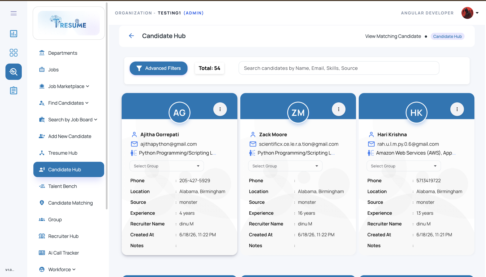
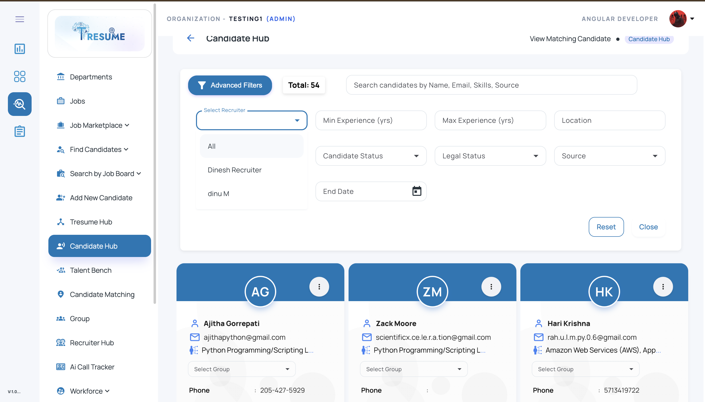
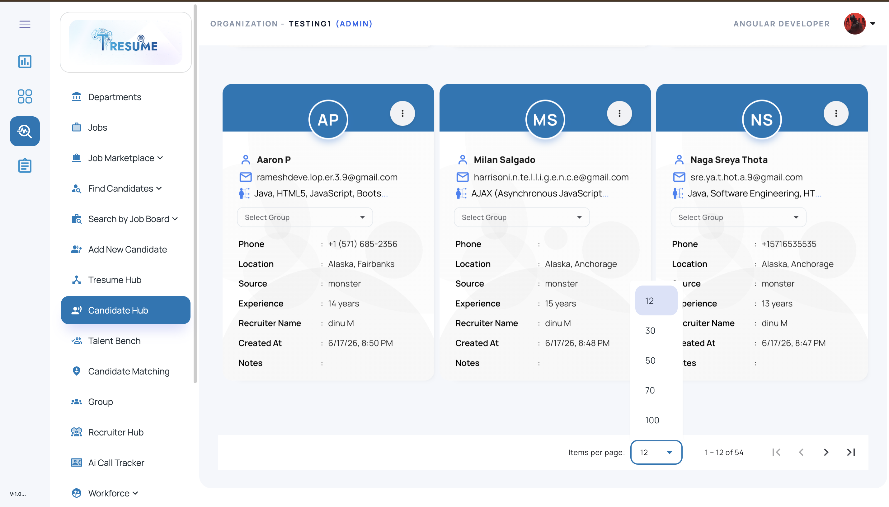

# ATS Candidate Management UI

A modern **ATS (Applicant Tracking System) Candidate Management module** built with **Angular**, **Node.js**, and **Microsoft SQL Server**.
This project is designed to streamline recruiter workflows by providing a clean candidate listing interface with **search, advanced filters, pagination, group assignment, and candidate cards**.

---

## 🚀 Overview

This module is part of a recruiter-focused ATS workflow and helps manage candidate records in a structured and scalable way.

It provides a clean dashboard experience for:

* browsing candidate profiles
* searching candidates by name, email, skills, or source
* applying advanced recruiter filters
* viewing candidate details in a card-based layout
* assigning candidates to groups
* managing large candidate lists with pagination

The UI is designed to support **real-world recruitment operations** and enterprise HR workflows.

---

## ✨ Features

### Candidate Listing UI

* Responsive **candidate card layout**
* Candidate initials avatar display
* Candidate information summary:

  * Name
  * Email
  * Skills
  * Phone
  * Location
  * Source
  * Experience
  * Recruiter name
  * Created date
  * Notes

### Search & Filters

* Global candidate search by:

  * Name
  * Email
  * Skills
  * Source
* **Advanced filter panel**
* Recruiter filter
* Min / Max experience filter
* Candidate status filter
* Legal status filter
* Source filter
* Location filter
* End date filter

### Workflow Features

* Group selection dropdown for each candidate
* Candidate actions menu
* Total candidate count display
* Candidate source visibility
* Recruiter-based candidate management flow

### Pagination

* Configurable **items per page**
* Pagination controls for navigating candidate records
* Scalable candidate list rendering

---

## 🛠️ Tech Stack

### Frontend

* **Angular**
* **TypeScript**
* **HTML5**
* **SCSS / CSS**
* **Angular Material**

### Backend

* **Node.js**
* **Express.js**

### Database

* **Microsoft SQL Server**

---

## 📂 Project Structure

```bash id="h2pl7r"
ats-candidate-management-ui/
│
├── frontend/                     # Angular application
│   ├── src/
│   │   ├── app/
│   │   │   ├── components/
│   │   │   │   └── candidate-management/
│   │   │   ├── services/
│   │   │   ├── models/
│   │   │   └── shared/
│   │   ├── assets/
│   │   └── environments/
│   └── angular.json
│
├── backend/                      # Node.js / Express backend
│   ├── routes/
│   ├── controllers/
│   ├── db/
│   ├── config/
│   └── server.js
│
├── database/
│   └── schema.sql               # SQL table / sample schema
│
└── README.md
```

---

## 🖥️ Core UI Screens

### 1. Candidate Listing Dashboard

Displays all candidate records in a card-based ATS view with:

* total candidate count
* search bar
* candidate cards
* group selection
* recruiter and source details

### 2. Advanced Filter Panel

Allows recruiters to filter candidates using:

* recruiter
* experience range
* location
* candidate status
* legal status
* source
* end date

### 3. Pagination View

Supports large candidate datasets using:

* page navigation
* items per page control
* scalable candidate rendering

---

## 📸 Screenshots

### Candidate Listing Dashboard



### Advanced Filter Panel



### Pagination View



> Create a folder named **`screenshots`** in the repo root and place your UI images there with these names:

* `candidate-list.png`
* `candidate-filters.png`
* `candidate-pagination.png`

---

## 🧪 Sample Candidate Data Structure

Below is a sample JSON structure used for candidate card rendering:

```json id="jvto98"
[
  {
    "candidateId": 101,
    "name": "Ajitha Gorrepati",
    "email": "ajithapython@gmail.com",
    "skills": ["Python", "Programming", "Scripting"],
    "phone": "205-427-5929",
    "location": "Alabama, Birmingham",
    "source": "monster",
    "experience": 4,
    "recruiterName": "dinu M",
    "createdAt": "2026-06-18T23:22:00",
    "notes": "",
    "groupId": null
  }
]
```

---

## 🗄️ Example SQL Table Structure

```sql id="xarj7e"
CREATE TABLE Candidates (
    CandidateId INT IDENTITY(1,1) PRIMARY KEY,
    FullName NVARCHAR(150) NOT NULL,
    Email NVARCHAR(150),
    Phone NVARCHAR(50),
    Skills NVARCHAR(MAX),
    Location NVARCHAR(150),
    Source NVARCHAR(100),
    ExperienceYears INT,
    RecruiterName NVARCHAR(150),
    CreatedAt DATETIME DEFAULT GETDATE(),
    Notes NVARCHAR(MAX),
    GroupId INT NULL
);
```

---

## ⚙️ Setup Instructions

## 1) Clone the repository

```bash id="88z6fx"
git clone https://github.com/YOUR-USERNAME/ats-candidate-management-ui.git
cd ats-candidate-management-ui
```

---

## 2) Frontend setup (Angular)

```bash id="5mjlwm"
cd frontend
npm install
ng serve
```

Open in browser:

```bash id="uxpxhh"
http://localhost:4200
```

---

## 3) Backend setup (Node.js)

```bash id="3icjlwm"
cd backend
npm install
npm start
```

---

## 4) Database setup (Microsoft SQL Server)

* Create a database in SQL Server
* Run the schema file from the `database/` folder
* Update DB credentials in your backend config file

Example configuration:

```js id="s7j1q7"
const config = {
  user: "your_sql_username",
  password: "your_sql_password",
  server: "localhost",
  database: "ATS_DB",
  options: {
    trustServerCertificate: true
  }
};
```

---

## 🔌 API Flow (Example)

Typical backend endpoints for this module may include:

* `GET /api/candidates` → fetch all candidates
* `GET /api/candidates/:id` → fetch candidate details
* `POST /api/candidates/filter` → filter candidates
* `PUT /api/candidates/:id/group` → assign candidate to group

---

## 📈 Use Cases

This project can be used as a demo / reference implementation for:

* ATS candidate management systems
* recruiter dashboards
* HRMS candidate workflow modules
* hiring operations platforms
* enterprise candidate listing UI design

---

## 🔒 Important Note

This repository is intended as a **demo / showcase version** of a candidate management workflow.
Do **not** include:

* production credentials
* real candidate data
* company-sensitive business logic
* internal API secrets
* `.env` files with private keys

Use **mock / sanitized sample data** when publishing publicly.

---

## 🚀 Future Improvements

* Candidate detail drawer / modal
* Resume preview integration
* bulk candidate actions
* export candidate list to Excel
* recruiter performance dashboard
* candidate notes management
* shortlist / pipeline integration
* AI-powered candidate matching

---

## 👨‍💻 Author

**Dinesh M**
Software Developer | Angular · Node.js · Microsoft SQL Server · ATS / HRMS · AI Automation

* GitHub: https://github.com/Dinesh-T-2005
* LinkedIn: https://www.linkedin.com/in/dinesh-m-a5698b330/
* Email: [dinesh996528@gmail.com](mailto:dinesh996528@gmail.com)

---

## 📄 License

This project is shared for learning, demonstration, and portfolio purposes.
